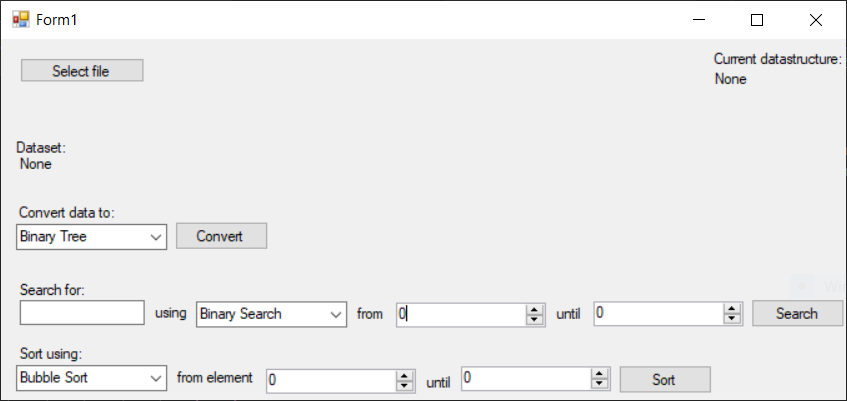

# Data Structures & Algorithms in C#

This is a student project focused on implementing foundational data structures and algorithms in C#. It was developed as part of an academic coursework assignment to demonstrate understanding of data handling, algorithmic problem solving, and runtime analysis.

The project is not UI-focused — the graphical interface (built in WinForms) was kept minimal for demo and testing purposes only. The core logic resides in separate, well-structured classes that are fully unit tested using MSTest.

## 🧱 Implemented Data Structures

- **Doubly Linked List**  
- **Binary Search Tree**
- **Array List** (custom implementation with dynamic resizing)

## ⚙️ Algorithms

### Sorting:
- Bubble Sort
- Quick Sort

### Searching:
- Linear Search
- Binary Search 

Each algorithm supports sorting or searching on a full or partial range of the dataset, with time measurements captured for performance comparison.

## 📦 Features

- **CSV Importing**  
  Parses integer sequences from `.csv` files. Although the data structures are generic, the importer currently only supports integer parsing.

- **Structure Conversion**  
  Once data is imported, it can be dynamically converted between the supported structures for testing.

- **UI (WinForms)**  
  A minimal interface allows:
  - selecting a `.csv` file
  - choosing data structure conversions
  - sorting and searching with configurable range
  - displaying results and timing feedback

- **Unit Tests**  
  Separate test project (`DaATests`) with full coverage for:
  - Data structure correctness (add/remove/insert operations)
  - Sorting algorithms (including edge cases and partial ranges)
  - Search algorithms (positive and negative test cases)

## 📝 Project Context

This was developed as a **university coursework project**. The primary goal was to gain hands-on experience implementing data structures and algorithms from scratch, and to analyze their behavior with different input sizes and cases.

The project is not intended for production use, and the UI layer was purposefully kept simple to emphasize logic correctness and testability.

## 🔧 Tech Stack

- C# (.NET Framework 4.8)
- WinForms (for minimal interaction)
- MSTest (for unit testing)
- Visual Studio Solution with multi-project structure

## 🖼️ Screenshot

### 🏁 Steps to Run

1. Open `DaA.sln` in Visual Studio  
2. Build and run the project (`Ctrl + F5`)  
3. Use the **"Select file"** button to import a `.csv` file of **comma-separated integers**

---

### 🧪 Usage Guide

Once a dataset is loaded:

#### 1. **Convert the dataset**
Use the dropdown to convert the data into one of:
- Doubly Linked List
- Binary Tree
- Array List

#### 2. **Search for a value**
- Choose a search algorithm (Linear or Binary)
- Input the value to search for
- Optionally define a range (start and end index)

#### 3. **Sort the dataset**
- Choose Bubble Sort or Quick Sort
- You may define a partial range  
  *(Note: Binary Tree only supports full sorting)*

## Notes
1. Binary Search requires the list to be sorted and therefore Quick Sort is performed before Binary Search. The user will be informed of this.
2. The Binary Tree does support sorting but not partial sorting. For partial sort, the tree would have to be split up and merged back together which would ultimately lead to the same result as a full sort. Otherwise this would violate the rules of a binary tree. Therefore partial sort is not supported. THe user will be informed of this. 
3. The CSV file importer will only parse integers. Whilst the datastructures and algorithms implement a generic type, the CSV parser only takes integers. This can be changed if needed.
